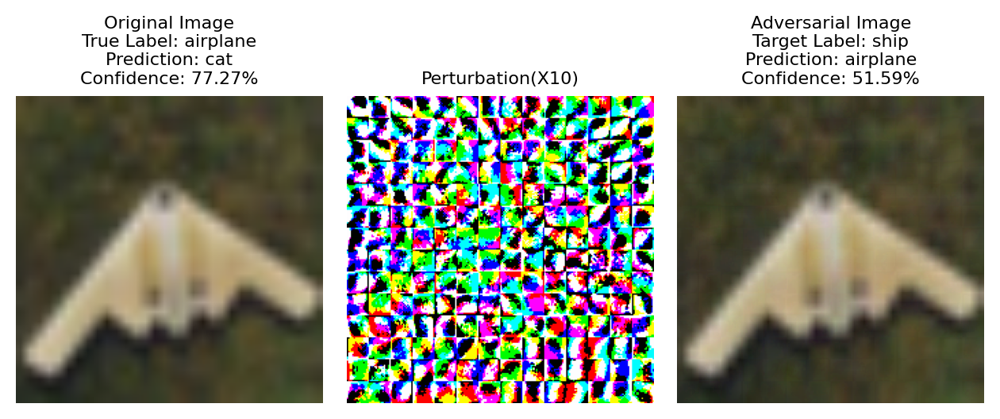

# FGSM: Fast Gradient Sign Method Experiments

This repository contains code and scripts for running and reproducing experiments with the Fast Gradient Sign Method (FGSM) on CIFAR-10 and MNIST datasets, using ResNet18 and ViT-T/16 architectures.

## Requirements

- Python 3.x
- PyTorch
- Other dependencies (see `requirements.txt` if available)

## Getting Started

### 1. Download Checkpoints

Before running attacks, download the pretrained checkpoints and place them in the project root folder to reproduce the reported results:
```
# Install gdown if not already installed
pip install gdown

# Download the pretrained checkpoints from Google Drive
gdown https://drive.google.com/uc?id=1jbuI-dWhU93UzaNQpu1YjVro4wke0OSl

# Extract the archive into the project root folder
unzip filename.zip -d ./
```

### 2. Training

If you prefer, train the models from scratch using the following commands:

```bash
# Train ResNet18 on CIFAR-10
bash scripts/train/resnet18_cifar10.sh

# Train ResNet18 on MNIST
bash scripts/train/resnet18_mnist.sh

# Train Tiny-ViT on CIFAR-10
bash scripts/train/tiny_vit_cifar10.sh

# Train Tiny-ViT on MNIST
bash scripts/train/tiny_vit_mnist.sh
```

### 3. Attacking

To run FGSM attacks on the trained models, use the following commands:

```bash
# Attack ResNet18 on CIFAR-10
bash scripts/attack/resnet18_cifar10.sh

# Attack ResNet18 on MNIST
bash scripts/attack/resnet18_mnist.sh

# Attack Tiny-ViT on CIFAR-10
bash scripts/attack/tiny_vit_cifar10.sh

# Attack Tiny-ViT on MNIST
bash scripts/attack/tiny_vit_mnist.sh
```

### 4. Results

- **Logs:** All results and logs will be stored in the `logs/` directory.
- **Visualizations:** Visual outputs and figures will be saved in the `assets/` directory.

---

# Experimental Results

## 📊 ResNet-18 - CIFAR-10

| ϵ | Clean Acc (%) | Robust Acc (%) | Untargeted ASR (%) | Targeted (Random) ASR (%) | Targeted (Least Likely) ASR (%) |
|---|---------------|----------------|-------------------|---------------------------|---------------------------------|
| 1/255 | 95.01 | 79.48 | 20.52 | 3.16 | 0.01 |
| 2/255 | 95.01 | 62.75 | 37.25 | 7.41 | 0.02 |
| 4/255 | 95.01 | 39.89 | 60.11 | 16.13 | 0.24 |
| 8/255 | 95.01 | 20.76 | 79.24 | 25.08 | 1.19 |

## 📊 ViT-T/16 - CIFAR-10

| ϵ | Clean Acc (%) | Robust Acc (%) | Untargeted ASR (%) | Targeted (Random) ASR (%) | Targeted (Least Likely) ASR (%) |
|---|---------------|----------------|-------------------|---------------------------|---------------------------------|
| 1/255 | 88.47 | 73.23 | 26.77 | 3.24 | 0.00 |
| 2/255 | 88.47 | 54.23 | 45.77 | 9.25 | 0.01 |
| 4/255 | 88.47 | 25.40 | 74.60 | 23.90| 0.81 |
| 8/255 | 88.47 | 6.21 | 93.79 | 45.51 |7.18 |

## 📊 ResNet-18 - MNIST

| ϵ | Clean Acc (%) | Robust Acc (%) | Untargeted ASR (%) | Targeted (Random) ASR (%) | Targeted (Least Likely) ASR (%) |
|---|---------------|----------------|-------------------|---------------------------|---------------------------------|
| 1/255 | 99.34 | 99.23 | 0.77 | 0.02 | 0.00 |
| 2/255 | 99.34 | 99.03 | 0.97 | 0.03 | 0.00 |
| 4/255 | 99.34 | 98.79 | 1.21 | 0.05 | 0.00 |
| 8/255 | 99.34 | 98.01 | 1.99 | 0.20 | 0.00 |

## 📊 ViT-T/16 - MNIST

| ϵ | Clean Acc (%) | Robust Acc (%) | Untargeted ASR (%) | Targeted (Random) ASR (%) | Targeted (Least Likely) ASR (%) |
|---|---------------|----------------|-------------------|---------------------------|---------------------------------|
| 1/255 | 97.54 | 96.22 | 3.78 | 0.21 | 0.00 |
| 2/255 | 97.54 | 94.29 | 5.71 | 0.56 | 0.00 |
| 4/255 | 97.54 | 88.16 | 11.84 | 1.70 | 0.00 |
| 8/255 | 97.54 | 70.28 | 29.72 | 6.05 | 0.00 |


## 📈 FGSM Attack Success Rate vs Epsilon

This section shows the **Attack Success Rate (ASR)** for each model and dataset with varying perturbation magnitudes (ϵ = 1/255, 2/255, 4/255, 8/255).  


| CIFAR-10 | MNIST |
|----------|-------|
|   |  |
|  |  |


# FGSM Attack Visualization

This section contains visualizations of **original**, **perturbation**, and **adversarial examples** (ϵ = 8/255) on two models (**ResNet-18** and **ViT-T/16**) across two datasets (**CIFAR-10** and **MNIST**).  

Each model × dataset includes examples of:
- **Untargeted** — success / failure  
- **Targeted (random)** — success / failure  
- **Targeted (least-likely)** — success / failure  

## 📊 CIFAR-10 - ResNet-18

| Untargeted - Success | Untargeted - Failure |
|-----|-----|
|  |  |


| Targeted (random) - Success | Targeted (random) - Failure |
|-----|-----|
|  |  |

| Targeted (Least Likely) - Success | Targeted (Least Likely) - Failure |
|-----|-----|
|  |  |


## 📊 CIFAR-10 - ViT-T/16

| Untargeted - Success | Untargeted - Failure |
|---------|---------|
|  |  |

| Targeted (ranodm) - Success | Targeted (random) - Failure |
|---------|---------|
|  |  |

| Targeted (Least Likely) - Success | Targeted (Least Likely) - Failure |
|---------|---------|
|  |  |


## 📊 MNIST - ResNet-18

| Untargeted - Success | Untargeted - Failure |
|---------|---------|
|  |  |

| Targeted (random) - Success | Targeted (random) - Failure |
|---------|---------|
|  |  |

| Targeted (Least Likely) - Failure |
|---------|
|  |


## 📊 MNIST - ViT-T/16

| Untargeted - Success | Untargeted - Failure |
|---------|---------|
|  |  |

| Targeted (ranodm) - Success | Targeted (random) - Failure |
|---------|---------|
|  |  |

| Targeted (Least Likely) - Failure |
|---------|
|   |


## 📝 Notes
- **Success**: adversarial attack achieved its objective.  
- **Failure**: adversarial perturbation did not fool the model.  
- Visualizations include **original image**, **perturbation**, and **adversarial example**.  
- Attacks performed with **FGSM** (ϵ = 8/255).


For any questions or issues, please open an issue in this repository.

---


